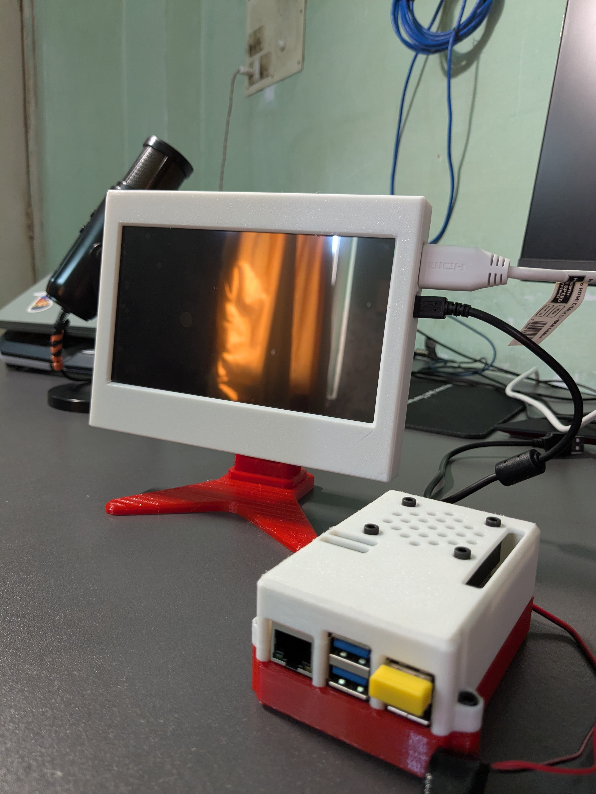
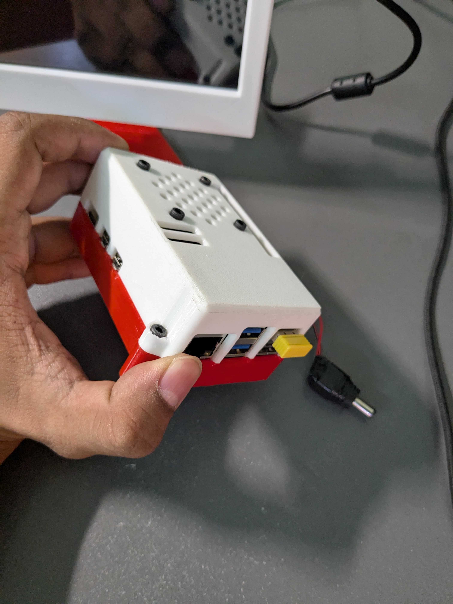
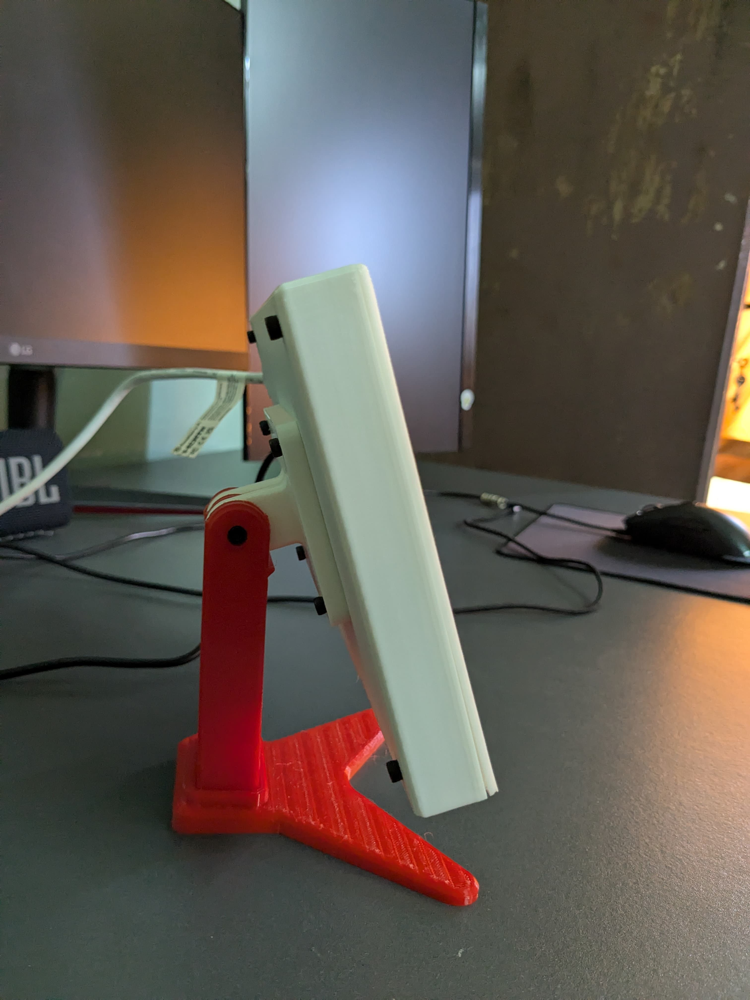
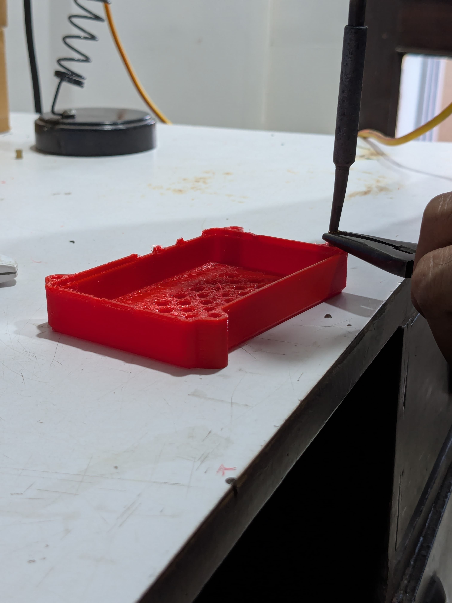
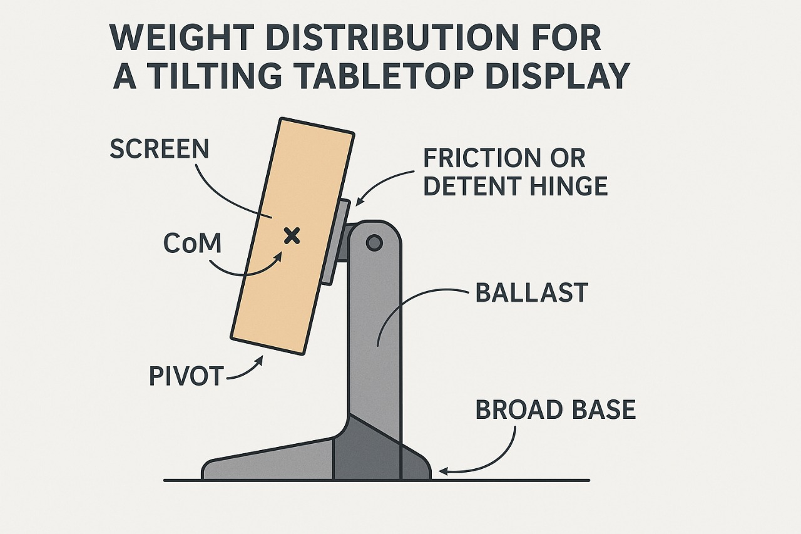
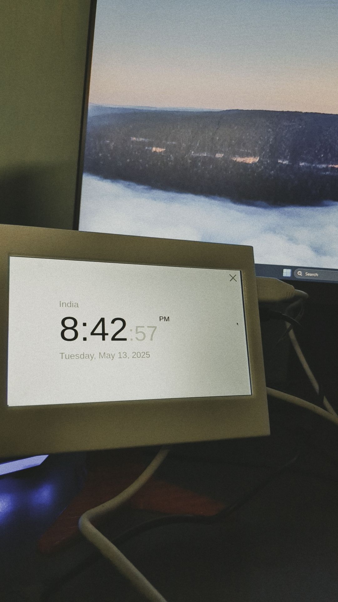

# The Omni-Terminal: Pi 5 Desktop Hub




## 🚀 The Why: More Than Just a Computer

Why settle for a static monitor when you can build a living, breathing command center? 

**The Omni-Terminal** is designed to be the ultimate desktop companion—a "J.A.R.V.I.S.-like" hub that sits elegantly on your desk, ready to manage your music, display critical information, and control your smart home. It's not just about utility; it's about the **experience**. 

This project moves away from messy wires and bare circuit boards. It encapsulates the raw power of the **Raspberry Pi 5 (8GB)** into a sleek, custom-engineered enclosure that looks and feels like a premium consumer product. Whether you're coding, gaming, or just relaxing, the Omni-Terminal is always on, always ready.

---

## ✨ Features

### 🏠 Smart Hub
Centralize your control. Manage your smart lights, plugs, and sensors directly from the touchscreen. The Omni-Terminal acts as the brain of your connected environment.

### 🎵 Media Station
Your dedicated Spotify controller. deeply integrated media controls let you browse playlists, skip tracks, and adjust volume without ever leaving your workflow on your main PC.

### 📅 Info Deck
Stay informed at a glance. The always-on dashboard displays time, local weather, calendar events, and system stats, ensuring you never miss a beat.

### 🖥️ Dual-Purpose Display
Need more screen real estate? The 7-inch capacitive touchscreen doubles as a secondary external monitor for your main PC, perfect for Discord, system monitoring, or a dedicated terminal window.

---

## 🛠️ The Design: Custom Engineering

This isn't a generic case download. The enclosure for the Omni-Terminal was designed from scratch, iterating through **5 major versions** to achieve the perfect balance of aesthetics and functionality.

The design features:
- **Precision Fit:** Tailored specifically for the Raspberry Pi 5 and the official 7-inch Touchscreen.
- **Active Cooling:** A dedicated `Cooler Casing` directs airflow over the Pi's active cooler, ensuring the 8GB model runs at peak performance even under heavy loads.
- **Modular Assembly:** Easy access to ports and GPIO pins.

### 3D Files Included
We believe in Open Source Hardware. All the original design files are included in this repository so you can print, modify, and improve upon the design.

- **`Pi 5 case v5_v2.0.STEP`**: The main innovative chassis.
- **`PI_5+cooler Casing.STEP`**: The specialized airflow housing.
- **`Screen Cover 2.STEP`**: The bezel and screen mount.

---

## 📋 Hardware Checklist

Everything you need to build your own Omni-Terminal:

| Component | Description |
| :--- | :--- |
| **Raspberry Pi 5** | 8GB RAM Model recommended for smooth multitasking |
| **Display** | Official Raspberry Pi 7-inch Touchscreen Display |
| **Storage** | High-speed microSD card (64GB+ recommended) |
| **Power Supply** | Official Raspberry Pi 27W USB-C Power Supply |
| **Cooling** | Raspberry Pi Active Cooler |
| **Casing** | 3D Printed parts (files provided) |
| **Misc** | M2.5 Screws and standoffs |

---

## ⚙️ Software & Setup

The Omni-Terminal runs on **Raspberry Pi OS**, customized for a touch-first experience.

### Quick Start

1.  **Clone the Repository:**
    ```bash
    git clone https://github.com/yourusername/omni-terminal.git
    cd omni-terminal
    ```

2.  **Install Dependencies:**
    Run the setup script to install necessary Python libraries and UI frameworks.
    ```bash
    ./setup.sh
    ```

3.  **Launch the Dashboard:**
    ```bash
    python3 main.py
    ```

*(Detailed installation guide coming soon in the Wiki)*

---

## 📸 Gallery

Admire the build from every angle.

| | | |
|:-------------------------:|:-------------------------:|:-------------------------:|
|  |  |  |
|  |  |  |

---

## 🔮 Future Scope

The Omni-Terminal is an evolving project. Here is what is on the roadmap:

-   **🎙️ Voice Assistant:** Integration with local LLMs for true offline voice control.
-   **🏠 Home Assistant Bridge:** Seamless two-way sync with Home Assistant instances.
-   **📷 Vision:** Integrated camera support for gesture control and presence detection.

---

## 🤝 Call to Action

**Build it. Mod it. Share it.**

This project is open source because innovation thrives in community. 
- **Fork this repo** and add your own modules.
- **Print the case** and show us your color schemes.
- **Share your build** on social media and tag us!

***

*Created with ❤️ by a Maker, for Makers.*
